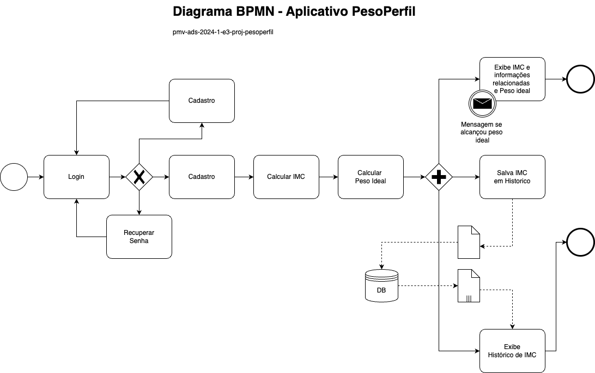

# Especificações do Projeto

Nesta seção do documento, serão abordadas as especificações detalhadas do projeto do aplicativo de Monitoramento de Índice de Massa Corporal (IMC). As especificações incluirão uma análise detalhada dos requisitos funcionais e não funcionais do aplicativo, juntamente com os recursos e funcionalidades planejados para atender às necessidades dos usuários. Para realizar essa tarefa, serão empregadas diversas técnicas e ferramentas, incluindo:

1. **Levantamento de Requisitos:** Utilização de entrevistas com potenciais usuários, profissionais de saúde e especialistas em design de experiência do usuário (UX) para identificar e compreender as necessidades, preferências e expectativas dos usuários em relação ao aplicativo.

2. **Análise Competitiva:** Avaliação de aplicativos similares disponíveis no mercado para identificar pontos fortes e fracos, bem como oportunidades de diferenciação e inovação para o aplicativo de Monitoramento de IMC.

3. **Prototipagem e Design Iterativo:** Utilização de ferramentas de prototipagem e design, como Adobe XD, Sketch ou Figma, para criar protótipos interativos do aplicativo e realizar testes de usabilidade com usuários para iterar e refinar o design.

4. **Modelagem de Dados:** Desenvolvimento de modelos de dados para representar as informações que serão armazenadas e manipuladas pelo aplicativo, utilizando ferramentas como diagramas de entidade-relacionamento (ER) ou diagramas de classe UML.

5. **Definição de Requisitos Funcionais e Não Funcionais:** Documentação dos requisitos funcionais, que descrevem as principais funcionalidades e comportamentos esperados do aplicativo, e dos requisitos não funcionais, que abordam aspectos como desempenho, segurança e usabilidade.

6. **Estimativa de Recursos e Cronograma:** Estimativa dos recursos necessários para o desenvolvimento do aplicativo, incluindo tempo, equipe e tecnologias, e criação de um cronograma detalhado para orientar o processo de desenvolvimento.

Essas técnicas e ferramentas serão empregadas de forma integrada para garantir que as especificações do projeto sejam abrangentes, precisas e alinhadas com as necessidades e expectativas dos usuários, resultando em um aplicativo eficaz e satisfatório para o público-alvo.

## Personas

<tr>
<td rowspan=3>   </td>
1. Luciana Miller, Profissional de Saúde Ocupada: Idade: 35 anos Profissão: Médica 
Descrição: Luciana é uma médica ocupada que trabalha longas horas no hospital. Ela quer um aplicativo de monitoramento de IMC que seja rápido e fácil de usar, permitindo-lhe acompanhar o IMC de seus pacientes em tempo real e fornecer conselhos de saúde quando necessário.
</tr>  

<tr>
<td rowspan=3>   </td>
2. Pedro Henrique, Atleta Amador: Idade: 28 anos Profissão: Engenheiro 
Descrição: Pedro é um entusiasta do fitness que pratica esportes regularmente. Ele deseja um aplicativo que não só rastreie seu IMC, mas também forneça insights sobre como melhorar sua composição corporal e desempenho atlético.
</tr>  

<tr>
<td rowspan=3>   </td>
3. Ana Lucia, Estudante Universitária: Idade: 20 anos Profissão: Estudante de Medicina 
Descrição: Ana está estudando medicina e está interessada em aprender mais sobre saúde e nutrição. Ela procura um aplicativo que não apenas monitore seu IMC, mas também forneça informações educativas sobre alimentação saudável e estilo de vida.
</tr>  

<tr>
<td rowspan=3>   </td>
4. Márcio Oliveira, Pai de Família: Idade: 42 anos Profissão: Gerente de Vendas 
Descrição: Márcio é um pai ocupado com responsabilidades familiares e profissionais. Ele deseja um aplicativo simples e intuitivo que o ajude a monitorar seu IMC e o de sua família, facilitando a manutenção de hábitos saudáveis para todos.
</tr>  

<tr>
<td rowspan=3>   </td>
5. Sofia Santos, Aposentada Ativa: Idade: 65 anos Profissão: Aposentada 
Descrição: Sofia é uma aposentada que gosta de manter um estilo de vida ativo. Ela busca um aplicativo que a ajude a monitorar seu IMC e a saúde geral à medida que envelhece, com dicas específicas para sua faixa etária.
</tr>  

## Histórias de Usuários

Com base na análise das personas forma identificadas as seguintes histórias de usuários:

|EU COMO... `PERSONA`| QUERO/PRECISO ... `FUNCIONALIDADE` |PARA ... `MOTIVO/VALOR`                 |
|--------------------|------------------------------------|----------------------------------------|
|Luciana Miller		|quero poder cadastrar rapidamente os IMCs dos meus pacientes durante consultas para acompanhar sua saúde ao longo do tempo.| uma melhor gestão do atendimento e fornecendo orientações de saúde mais precisas.| 
|Pedro Henrique 	|gostaria de poder sincronizar meu aplicativo com dispositivos de rastreamento de fitness para que meu que IMC seja atualizado automaticamente com meus dados de atividade física.|facilitar meu acompanhamento de desempenho atlético e ajustes necessários em minha rotina de exercícios.|
|Ana Lucia 		    |desejo ter acesso a artigos e dicas sobre nutrição saudável diretamente no aplicativo para me educar sobre hábitos alimentares adequados.|aumentar meu conhecimento em saúde e nutrição para aplicação profissional futura.|
|Márcio	Oliveira	|quero poder adicionar os perfis de cada membro da minha família no aplicativo para monitorar seus IMCs e garantir que todos estejam saudáveis.|promover hábitos saudáveis em casa e cuidando da saúde de toda a família.|
|Sofia Santos 		|gostaria de receber lembretes personalizados no aplicativo para fazer check-ups de saúde regulares e monitorar meu IMC à medida que envelheço.|promover uma abordagem proativa para minha saúde e bem-estar na terceira idade.|
|Luciana Miller 	|preciso de uma ferramenta de análise de dados no aplicativo que me permita identificar tendências de saúde em meus pacientes com base em seus IMCs ao longo do tempo.|facilitar a tomada de decisões clínicas e fornecendo um cuidado mais personalizado.|
|Pedro Henrique 	|quero poder definir metas de IMC no aplicativo e receber recomendações personalizadas para alcançar esses objetivos de forma saudável.|que eu seguir motivado a manter hábitos saudáveis e atingir metas de composição corporal.|
|Ana Lucia 		    |gostaria de ter acesso a uma calculadora de calorias no aplicativo para ajudar a controlar minha ingestão diária de alimentos e manter um peso saudável.|facilitar o monitoramento da minha dieta e promovendo escolhas alimentares conscientes.|
|Márcio Oliveira	|desejo receber notificações automáticas no aplicativo quando o IMC de um membro da minha família estiver fora da faixa saudável, para que possamos agir rapidamente.|garantir que todos na família mantenham um estilo de vida saudável e evitando problemas de saúde futuros.|
|Sofia Santos		  |quero poder compartilhar meus dados de IMC com meu médico diretamente do aplicativo para que eles possam acompanhar minha saúde de perto e fornecer orientações específicas.|garantir uma comunicação eficiente com meu profissional de saúde e uma abordagem colaborativa para cuidar da minha saúde.|

## Requisitos

As tabelas que se seguem apresentam os requisitos funcionais e não funcionais que detalham o escopo do projeto.

### Requisitos Funcionais

|   ID    | Descrição do Requisito  | Prioridade |
|------|-----------------------------------------|----|
|RF_001| O aplicativo deve permitir que os usuários insiram seu peso e altura para calcular automaticamente seu Índice de Massa Corporal (IMC) de acordo com a fórmula padrão (IMC = peso / altura²). | ALTA |
|RF-002| Os usuários devem poder fornecer informações pessoais, como idade, sexo e nível de atividade física, para uma melhor precisão na avaliação do IMC e recomendações personalizadas.  | ALTA |
|RF-003| Deve ser possível para os usuários compartilharem seus resultados de IMC e conquistas de saúde com amigos, familiares ou profissionais de saúde por meio de mídias sociais ou outros canais. | BAIXA |
|RF-004| Deve ser possível para os usuários visualizarem um histórico de suas medições de IMC ao longo do tempo, permitindo o acompanhamento do progresso e identificação de tendências. | MÉDIA |
|RF-005| Os usuários devem poder estabelecer metas pessoais de IMC e receber feedback sobre seu progresso em relação a essas metas, incluindo gráficos e estatísticas visuais. | MÉDIA |
|RF-006| O aplicativo deve fornecer orientações e dicas de nutrição com base no IMC do usuário, incluindo sugestões de dieta equilibrada e recomendações de alimentos para promover a saúde e o bem-estar. | BAIXA |
|RF-007| Deve ser possível para os usuários receberem sugestões de exercícios físicos adequados ao seu IMC e objetivos de saúde, com opções para diferentes níveis de intensidade e preferências pessoais. | BAIXA |

### Requisitos não Funcionais

|ID     | Descrição do Requisito  |Prioridade |
|---------|-------------------------|----|
| RNF_001 | O aplicativo deve responder de forma rápida e eficiente, mesmo em dispositivos móveis com recursos limitados, garantindo uma experiência fluida para os usuários. | ALTA |
| RNF-002 | Deve ser implementado um sistema robusto de segurança para proteger os dados pessoais dos usuários, incluindo criptografia de ponta a ponta, proteção contra acesso não autorizado e conformidade com regulamentações de privacidade, como o GDPR.  | MÉDIA |
| RNF-003 | O aplicativo deve estar disponível continuamente para os usuários, com tempo de inatividade mínimo para manutenção e atualizações planejadas. | ALTA |
| RNF-004 | O aplicativo deve ser compatível com uma ampla variedade de dispositivos móveis, incluindo smartphones e tablets, e com diferentes sistemas operacionais, como iOS e Android. | BAIXA |
| RNF-005 | A interface do usuário deve ser intuitiva e fácil de usar, seguindo as diretrizes de design de usabilidade e acessibilidade para garantir que pessoas com deficiências físicas ou cognitivas também possam utilizar o aplicativo com facilidade. | BAIXA |
| RNF-006 | O aplicativo deve ser capaz de lidar com falhas de forma resiliente, oferecendo uma experiência contínua aos usuários, mesmo em situações de instabilidade na rede ou problemas de hardware. | ALTA |
| RNF-007 | O sistema deve ser projetado para escalar facilmente para lidar com um aumento no número de usuários e volume de dados, garantindo que o desempenho não seja comprometido à medida que a base de usuários cresce. | MEDIA |
| RNF-008 | O aplicativo deve suportar diferentes idiomas, moedas e formatos de data para atender a usuários em todo o mundo, proporcionando uma experiência localizada e culturalmente relevante. | BAIXA |
| RNF-009 | O código-fonte do aplicativo deve ser bem documentado e organizado, facilitando a manutenção contínua, correção de bugs e adição de novos recursos no futuro. | ALTA |
| RNF-010 | O aplicativo deve cumprir com os padrões e regulamentações relevantes da indústria e da área da saúde, garantindo sua conformidade com normas de segurança, privacidade e qualidade de software. | BAIXA |
| RNF-011 |  O aplicativo deve oferecer suporte a múltiplos idiomas para atender a uma ampla variedade de usuários em todo o mundo. | BAIXA |
| RNF-012 |  O aplicativo deve ser capaz de funcionar offline, permitindo que os usuários registrem suas medições de IMC e acessem informações básicas mesmo sem uma conexão ativa à internet.| BAIXA |
| RNF-013 |  O aplicativo deve exibir claramente o valor do IMC atual do usuário, juntamente com sua interpretação de acordo com as categorias de peso estabelecidas pela Organização Mundial da Saúde (OMS). | ALTA |

## Restrições

O projeto está restrito pelos itens apresentados na tabela a seguir.

| ID   | Restrição                                                    |
| ---- | ------------------------------------------------------------ |
| 01   | O projeto deve ser executado dentro de um orçamento pré-definido, levando em consideração custos de desenvolvimento, hospedagem, manutenção e marketing |
| 02   | O desenvolvimento do aplicativo deve ser concluído dentro de um prazo específico, considerando cronogramas de entrega, revisões e testes. |
| 03   | O aplicativo deve ser desenvolvido utilizando tecnologias compatíveis com os sistemas operacionais móveis alvo (iOS, Android), levando em consideração requisitos de desempenho, segurança e compatibilidade. |
| 04   | O aplicativo deve cumprir com as regulamentações locais e internacionais relacionadas à privacidade de dados, segurança da informação e outras normas aplicáveis à saúde digital. |
| 05   | O aplicativo deve ser projetado para funcionar em dispositivos móveis com diferentes capacidades de hardware e em condições variadas de rede, considerando restrições de largura de banda, velocidade de processamento e consumo de energia. |

## Modelagem do Processo de Negócio 

### Análise da Situação Atual

Atualmente, muitas pessoas enfrentam dificuldades ao monitorar seu Índice de Massa Corporal (IMC) e adotar hábitos saudáveis devido a uma série de desafios:

1. **Dificuldade de Cálculo Manual do IMC:** Para calcular o IMC, os indivíduos precisam recorrer a fórmulas ou tabelas específicas, o que pode ser complicado e demorado para muitos, especialmente aqueles com pouca familiaridade com cálculos matemáticos.

2. **Interpretação Limitada do IMC:** Mesmo após calcular o IMC, muitas pessoas têm dificuldade em interpretar seu significado e entender como ele se relaciona com sua saúde geral, incluindo riscos de doenças relacionadas ao peso.

3. **Falta de Feedback Personalizado:** Sem orientação especializada, os usuários muitas vezes não recebem feedback personalizado sobre como melhorar sua saúde com base em seus dados de IMC e hábitos de vida.

4. **Monitoramento Ineficiente de Hábitos de Saúde:** O monitoramento manual de hábitos de saúde, como alimentação e atividade física, é trabalhoso e sujeito a erros, dificultando a análise precisa do impacto desses hábitos na saúde e no IMC.

### Modelo do Sistema Atual:

Atualmente, os indivíduos interessados em monitorar seu IMC e adotar hábitos saudáveis geralmente seguem um processo manual e fragmentado:

1. **Cálculo do IMC:** Os usuários realizam cálculos manuais do IMC usando fórmulas específicas ou consultando tabelas de referência disponíveis em fontes como livros ou sites da internet.

2. **Interpretação do IMC:** Após calcular o IMC, os usuários podem recorrer a recursos online ou profissionais de saúde para interpretar o significado do IMC e entender como ele afeta sua saúde.

3. **Registro de Hábitos de Saúde:** Os usuários podem manter diários ou planilhas para registrar suas atividades físicas, ingestão de alimentos e outros hábitos de saúde, tentando analisar manualmente seus impactos no IMC.

4. **Feedback Limitado:** A maioria dos usuários não recebe feedback personalizado sobre seus hábitos de saúde e IMC, limitando sua capacidade de tomar medidas eficazes para melhorar sua condição física.

>[!IMPORTANT]
>
>Este modelo atual reflete a abordagem tradicional e manual para o monitoramento de saúde e IMC, que é trabalhosa, sujeita a erros e carece de orientação personalizada para promover mudanças eficazes de hábitos de vida.

### Descrição Geral da Proposta

A proposta apresentada é a criação de um aplicativo de Monitoramento de Índice de Massa Corporal (IMC), visando oferecer uma solução abrangente e acessível para ajudar os usuários a monitorar seu IMC, interpretar seus resultados e adotar hábitos saudáveis para melhorar sua saúde e bem-estar.

**Limites da Proposta:**
* A proposta se concentra principalmente no monitoramento do IMC e na promoção de hábitos saudáveis relacionados à saúde física e nutricional.
* Não aborda aspectos mais complexos da saúde, como condições médicas específicas ou doenças crônicas, que podem exigir abordagens mais especializadas.

**Ligações com as Estratégias e Objetivos do Negócio:**
* A proposta está alinhada com estratégias de negócios centradas no cliente, buscando atender às necessidades e expectativas dos usuários por meio de uma solução digital inovadora e personalizada.
* Contribui para os objetivos do negócio relacionados à promoção da saúde e do bem-estar da comunidade, incentivando mudanças positivas de estilo de vida e reduzindo os riscos associados a problemas de saúde relacionados ao peso.

**Oportunidades de Melhorias:**
* Integração com dispositivos de monitoramento de saúde: Explorar a possibilidade de integração com dispositivos wearable ou outros dispositivos de monitoramento de saúde para melhorar a precisão e a conveniência do monitoramento do IMC.
* Personalização e recomendações avançadas: Desenvolver algoritmos avançados para fornecer recomendações mais personalizadas com base nos dados do usuário, como histórico de saúde, preferências alimentares e metas individuais.
* Parcerias com profissionais de saúde: Estabelecer parcerias com profissionais de saúde, como nutricionistas e personal trainers, para oferecer serviços adicionais, como consultas virtuais e programas de treinamento personalizados.
* Expansão para além do IMC: Considerar a expansão do escopo do aplicativo para incluir outras métricas de saúde, como níveis de atividade física, qualidade do sono e saúde mental, oferecendo uma solução mais abrangente para o bem-estar geral dos usuários.

>[!IMPORTANT]
>
>Essas melhorias podem potencializar a proposta, tornando o aplicativo ainda mais valioso e eficaz para os usuários, ao mesmo tempo em que fortalecem sua posição no mercado de saúde digital.

### Processo PesoPerfil 

O aplicativo PesoPerfil é uma ferramenta projetada para ajudar usuários a calcular e monitorar seu Índice de Massa Corporal (IMC) e a gerenciar metas relacionadas ao peso e saúde. Utilizando um diagrama BPMN (Business Process Model and Notation), o processo do aplicativo é mapeado para facilitar o entendimento das operações e funcionalidades oferecidas. A seguir, apresenta-se a documentação detalhada do diagrama BPMN associado ao aplicativo PesoPerfil.

#### Início do Processo

**1. Login (Ponto de Início)**

- O processo começa com o usuário realizando o login no aplicativo.
- Caso não tenha credenciais válidas, o usuário pode optar por recuperar a senha ou proceder ao cadastro.

**2. Recuperação de Senha**

- Usuários que esqueceram a senha podem recuperá-la seguindo os procedimentos de segurança do aplicativo.

**3. Cadastro**

- Novos usuários realizam o cadastro fornecendo informações necessárias.
- Após o cadastro, o usuário é direcionado para calcular o IMC.

#### Cálculo do IMC

**4. Cálculo do IMC (RF_001 e RF_002)**

- O aplicativo permite que o usuário insira peso e altura para o cálculo automático do IMC.
- Informações adicionais como idade, sexo e nível de atividade física podem ser fornecidas para refinar o cálculo e as recomendações.

**5. Cálculo do Peso Ideal**

- Após o cálculo do IMC, o aplicativo calcula o peso ideal do usuário, com base nas informações fornecidas anteriormente.

#### Resultados e Histórico

**6. Exibição dos Resultados**

- O IMC e o peso ideal são exibidos, juntamente com informações e dicas personalizadas.
- Se o usuário atingiu o peso ideal, uma mensagem de congratulações é mostrada.

**7. Salvamento dos Dados (RF_004)**

- O IMC calculado é salvo no histórico do usuário na base de dados para acompanhamento futuro.

**8. Visualização do Histórico**

- O usuário pode visualizar o histórico de seus IMCs, permitindo acompanhar o progresso e identificar tendências.

#### Funcionalidades Adicionais

**9. Compartilhamento de Resultados (RF_003)**

- Usuários podem compartilhar seus resultados e conquistas de saúde com outras pessoas através de mídias sociais ou outros canais.

**10. Metas e Feedback (RF_005)**

- Os usuários podem estabelecer metas de IMC e acompanhar o progresso com feedback visual, como gráficos e estatísticas.

**11. Dicas de Nutrição (RF_006)**

- Com base no IMC, o aplicativo fornece orientações e dicas de nutrição, sugestões de dieta e recomendações alimentares.

**12. Sugestões de Exercícios (RF_007)**

- São fornecidas sugestões de exercícios físicos compatíveis com o IMC do usuário e seus objetivos de saúde.

#### Encerramento do Processo

- O processo é considerado concluído quando o usuário desliga o aplicativo ou sai da sessão ativa.
- Todas as informações são armazenadas de forma segura na base de dados do aplicativo para uso em sessões futuras.

## Indicadores de Desempenho

|Indicador | Objetivo | Descrição | Cálculo | Fonte de Dados | Perspectiva |
|--------- | -------- | --------- | ------- | -------------- | ----------- |
|Taxa de Registro de Usuários | Aumentar a base de usuários do aplicativo | Mede a proporção de novos usuários registrados em relação aos visitantes. | (Novos usuários registrados / Total de visitantes) * 100 | Registro de usuários | Processo Interno |
|Precisão do Cálculo do IMC | Garantir a precisão das medições de IMC | Avalia a precisão dos cálculos de IMC realizados pelo sistema. | (IMC calculado pelo sistema - IMC calculado manualmente) / IMC calculado manualmente * 100 | Cálculo de IMC | Processo Interno |
|Tempo Médio de Resposta do Sistema | Melhorar a eficiência do aplicativo | Mede o tempo médio que o sistema leva para responder às solicitações. | Soma dos tempos de resposta / Número de solicitações | Sistema | Processo Interno |
|Taxa de Retenção de Usuários | Aumentar a fidelidade dos usuários | Mede a porcentagem de usuários que retornam ao aplicativo regularmente. | (Usuários que retornaram / Total de usuários) * 100 | Registro de usuários | Cliente |
|Satisfação do Usuário | Melhorar a experiência do usuário | Avalia a satisfação dos usuários com o aplicativo por meio de pesquisas. | Pontuação média das pesquisas de satisfação | Pesquisas de satisfação | Cliente |

>[!IMPORTANT]
>
>Esses indicadores fornecem uma maneira de avaliar o desempenho do processo de Monitoramento de IMC, abrangendo aspectos como aquisição de usuários, qualidade do sistema, engajamento dos usuários e satisfação geral do cliente.

## Diagrama de Casos de Uso

# Matriz de Rastreabilidade

| Requisito | Objetivo de Negócio 1: Fornecer uma ferramenta útil para monitoramento de saúde | Objetivo de Negócio 2: Aumentar o engajamento dos usuários com o aplicativo |
| --------- | ------------------------------------------------------------------------------- | --------------------------------------------------------------------------- |
|  REQ001   | SIM                                                                             | NÃO                                                                         |
|  REQ002   | SIM                                                                             | SIM                                                                         |
|  REQ003   | SIM                                                                             | NÃO                                                                         |
|  REQ004   | SIM                                                                             | SIM                                                                         |
|  REQ005   | NÃO                                                                             | SIM                                                                         |

>[!IMPORTANT]
>
>Nesta tabela simplificada, cada linha representa um requisito específico do projeto "Calculadora de IMC", enquanto cada coluna representa um objetivo de negócio associado ao projeto. Os cruzamentos entre os requisitos e os objetivos indicam se há um relacionamento entre eles. Por exemplo, "Sim" indica que o requisito contribui para o alcance desse objetivo, enquanto "Não" indica que não há relação direta.

# Gerenciamento de Projeto

Com base nas áreas de conhecimento do PMBOK v6, vamos criar um esboço do Gerenciamento de Projeto para o projeto "Peso Perfil":

1. **Integração:**
- Desenvolver o plano de gerenciamento do projeto, integrando todas as áreas de conhecimento e definindo as principais entregas e marcos do projeto.

2. **Escopo:**
- Definir os requisitos do projeto, incluindo funcionalidades específicas da calculadora de IMC e os limites do que será entregue.

3. **Cronograma (Tempo):**
- Elaborar um cronograma detalhado, definindo as atividades, sequenciamento, estimativas de duração e desenvolvimento do cronograma do projeto.

4. **Custos:**
- Estimar os custos associados ao projeto, incluindo recursos necessários, custos de desenvolvimento e manutenção da aplicação da calculadora de IMC.

5. **Qualidade:**
- Estabelecer critérios de qualidade para o projeto, garantindo que a calculadora de IMC atenda aos padrões de precisão e usabilidade.

6. **Recursos:**
- Identificar, adquirir e gerenciar os recursos necessários para a execução do projeto, incluindo equipe, equipamentos e materiais.

7. **Comunicações:**
- Desenvolver um plano de comunicação para manter todas as partes interessadas informadas sobre o progresso do projeto, incluindo relatórios de status e reuniões regulares.

8. **Riscos:**
- Identificar os riscos potenciais associados ao projeto, avaliar sua probabilidade e impacto e desenvolver estratégias de mitigação e contingência.

9. **Aquisições:**
- Identificar as necessidades de aquisição de bens e serviços externos para o projeto, elaborar documentos de aquisição e gerenciar o processo de contratação.

10. **Partes Interessadas:**
- Identificar todas as partes interessadas relevantes para o projeto, entender suas necessidades e expectativas e gerenciar suas expectativas ao longo do ciclo de vida do projeto.

>[!IMPORTANT]
>
>Essas áreas de conhecimento do Gerenciamento de Projetos interagem entre si e devem ser consideradas de forma holística durante todo o ciclo de vida do projeto. Alterações em uma área podem afetar outras áreas e é essencial manter uma abordagem integrada para o sucesso do projeto.

## Gerenciamento de Tempo

Com diagramas bem organizados que permitem gerenciar o tempo nos projetos, o gerente de projetos agenda e coordena tarefas dentro de um projeto para estimar o tempo necessário de conclusão.

O gráfico de Gantt ou diagrama de Gantt também é uma ferramenta visual utilizada para controlar e gerenciar o cronograma de atividades de um projeto. Com ele, é possível listar tudo que precisa ser feito para colocar o projeto em prática, dividir em atividades e estimar o tempo necessário para executá-las.

## Gerenciamento de Equipe

O gerenciamento adequado de tarefas contribuirá para que o projeto alcance altos níveis de produtividade. Por isso, é fundamental que ocorra a gestão de tarefas e de pessoas, de modo que os times envolvidos no projeto possam ser facilmente gerenciados. 

## Gestão de Orçamento

O processo de determinar o orçamento do projeto é uma tarefa que depende, além dos produtos (saídas) dos processos anteriores do gerenciamento de custos, também de produtos oferecidos por outros processos de gerenciamento, como o escopo e o tempo.

