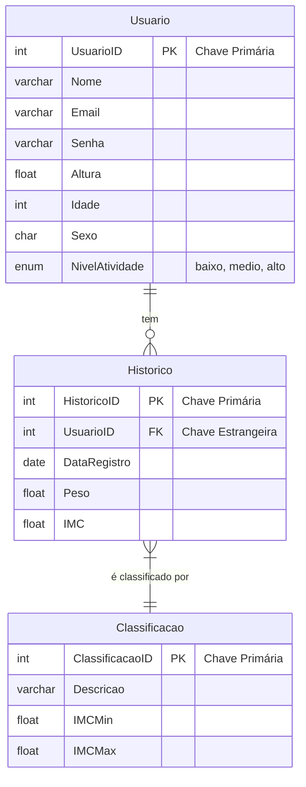

# Arquitetura da Solução

<span style="color:red">Pré-requisitos: <a href="3-Projeto de Interface.md"> Projeto de Interface</a></span>

Definição de como o software é estruturado em termos dos componentes que fazem parte da solução e do ambiente de hospedagem da aplicação.


## Diagrama de Classes


## Modelo ER


## Esquema Relacional

Essas tabelas descritas no diagrama abaixo, seus campos e relacionamentos formam a estrutura básica do modelo relacional a ser implementado em um sistema de banco de dados para o aplicativo PesoPerfil. 



#### Tabelas:

**1. Usuario**

- UsuarioID: INT, chave primária, autoincremento
- Nome: VARCHAR
- Email: VARCHAR
- Senha: VARCHAR
- Altura: FLOAT
- Idade: INT
- Sexo: CHAR(1)
- NivelAtividade: ENUM('baixo', 'medio', 'alto')

**2. Historico**

- HistoricoID: INT, chave primária, autoincremento
- UsuarioID: INT, chave estrangeira referenciando Usuario.UsuarioID
- DataRegistro: DATE
- Peso: FLOAT
- IMC: FLOAT

**3. Classificacao**

- ClassificacaoID: INT, chave primária, autoincremento
- Descricao: VARCHAR
- IMCMin: FLOAT
- IMCMax: FLOAT

#### Relacionamentos:

- **Usuario** possui um relacionamento um para muitos com **Historico**, indicando que um usuário pode ter vários registros históricos.
- **Historico** possui um relacionamento muitos para um com **Classificacao**, sugerindo que cada registro no histórico pode ser associado a uma classificação específica de IMC.

#### Restrições de Integridade:

- A chave estrangeira **UsuarioID** em **Historico** garante que cada registro no histórico esteja vinculado a um usuário existente.
- As chaves estrangeiras devem garantir a consistência referencial, de modo que as entradas relacionadas não possam ser excluídas enquanto houver dependências.


## Modelo Físico

```sql
-- Criação do banco de dados PesoPerfil
CREATE DATABASE PesoPerfilDB;

-- Conexão ao banco de dados criado
\c PesoPerfilDB

-- Criação da tabela 'Usuario'
CREATE TABLE Usuario (
    UsuarioID SERIAL PRIMARY KEY,
    Nome VARCHAR(255),
    Email VARCHAR(255) UNIQUE NOT NULL,
    Senha VARCHAR(255) NOT NULL,
    Altura FLOAT CHECK (Altura > 0),
    Idade INT CHECK (Idade > 0),
    Sexo CHAR(1) CHECK (Sexo IN ('M', 'F', 'O')), -- M = Masculino, F = Feminino, O = Outro
    NivelAtividade VARCHAR(50) CHECK (NivelAtividade IN ('baixo', 'medio', 'alto'))
);

-- Criação da tabela 'Historico'
CREATE TABLE Historico (
    HistoricoID SERIAL PRIMARY KEY,
    UsuarioID INT REFERENCES Usuario(UsuarioID) ON DELETE CASCADE,
    DataRegistro DATE NOT NULL,
    Peso FLOAT CHECK (Peso > 0),
    IMC FLOAT CHECK (IMC > 0)
);

-- Criação da tabela 'Classificacao'
CREATE TABLE Classificacao (
    ClassificacaoID SERIAL PRIMARY KEY,
    Descricao VARCHAR(255),
    IMCMin FLOAT CHECK (IMCMin >= 0),
    IMCMax FLOAT CHECK (IMCMax >= IMCMin)
);

```

Este arquivo de criação do banco de dados esta localizado em: `src\bd\PesoPerfilDB.sql`.

## Tecnologias Utilizadas

Descreva aqui qual(is) tecnologias você vai usar para resolver o seu problema, ou seja, implementar a sua solução. Liste todas as tecnologias envolvidas, linguagens a serem utilizadas, serviços web, frameworks, bibliotecas, IDEs de desenvolvimento, e ferramentas.

Apresente também uma figura explicando como as tecnologias estão relacionadas ou como uma interação do usuário com o sistema vai ser conduzida, por onde ela passa até retornar uma resposta ao usuário.

## Hospedagem

Explique como a hospedagem e o lançamento da plataforma foi feita.

> **Links Úteis**:
>
> - [Website com GitHub Pages](https://pages.github.com/)
> - [Programação colaborativa com Repl.it](https://repl.it/)
> - [Getting Started with Heroku](https://devcenter.heroku.com/start)
> - [Publicando Seu Site No Heroku](http://pythonclub.com.br/publicando-seu-hello-world-no-heroku.html)

## Qualidade de Software

Conceituar qualidade de fato é uma tarefa complexa, mas ela pode ser vista como um método gerencial que através de procedimentos disseminados por toda a organização, busca garantir um produto final que satisfaça às expectativas dos stakeholders.

No contexto de desenvolvimento de software, qualidade pode ser entendida como um conjunto de características a serem satisfeitas, de modo que o produto de software atenda às necessidades de seus usuários. Entretanto, tal nível de satisfação nem sempre é alcançado de forma espontânea, devendo ser continuamente construído. Assim, a qualidade do produto depende fortemente do seu respectivo processo de desenvolvimento.

A norma internacional ISO/IEC 25010, que é uma atualização da ISO/IEC 9126, define oito características e 30 subcaracterísticas de qualidade para produtos de software.
Com base nessas características e nas respectivas sub-características, identifique as sub-características que sua equipe utilizará como base para nortear o desenvolvimento do projeto de software considerando-se alguns aspectos simples de qualidade. Justifique as subcaracterísticas escolhidas pelo time e elenque as métricas que permitirão a equipe avaliar os objetos de interesse.

> **Links Úteis**:
>
> - [ISO/IEC 25010:2011 - Systems and software engineering — Systems and software Quality Requirements and Evaluation (SQuaRE) — System and software quality models](https://www.iso.org/standard/35733.html/)
> - [Análise sobre a ISO 9126 – NBR 13596](https://www.tiespecialistas.com.br/analise-sobre-iso-9126-nbr-13596/)
> - [Qualidade de Software - Engenharia de Software 29](https://www.devmedia.com.br/qualidade-de-software-engenharia-de-software-29/18209/)
